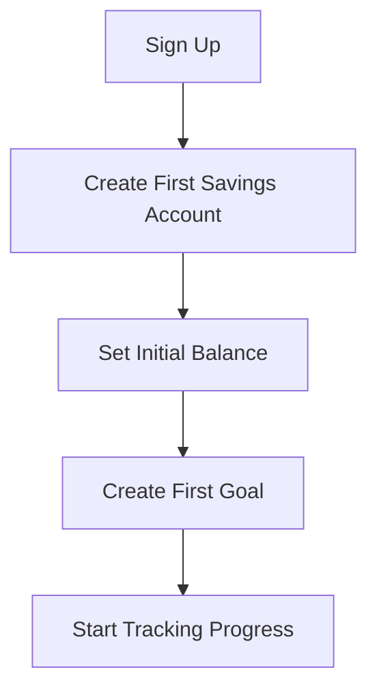
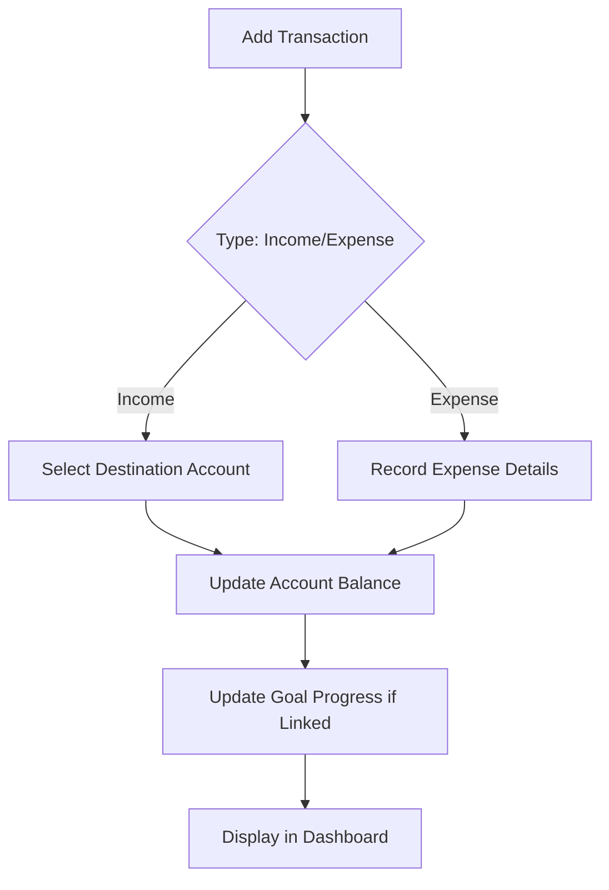
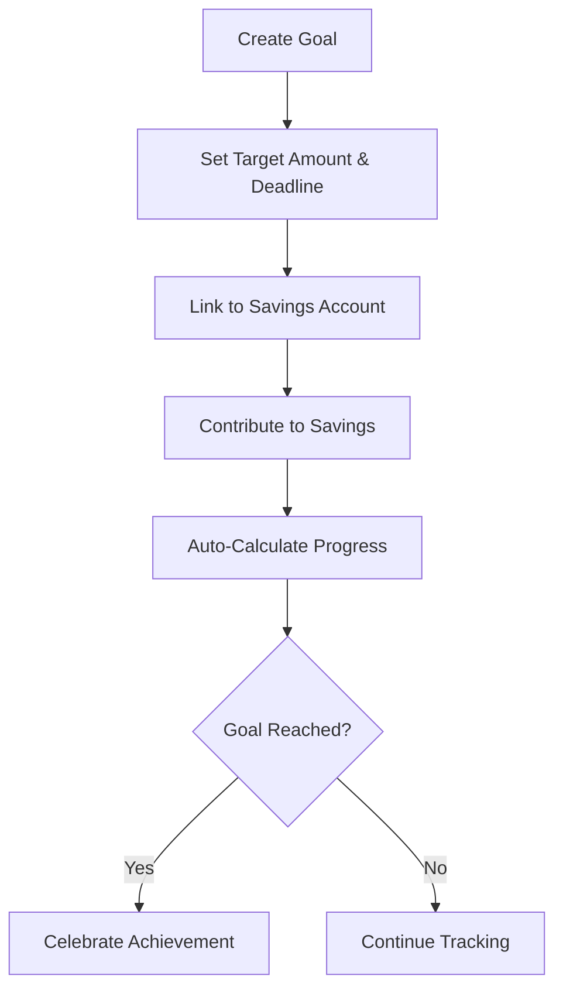

# BeRich - Personal Finance Management Platform

## 1. Product Overview

BeRich is a personal finance management web application that empowers users to take control of their financial journey. The platform enables users to track their current balance, manage savings accounts, and set financial goals with progress visualization.

**Core Value Propositions:**
- Real-time balance tracking across multiple accounts
- Visual savings goal management with progress indicators
- Intuitive dashboard with financial insights
- Clean, modern interface for stress-free financial management

## 2. Core Features

### 2.1 User Roles
| Role | Registration Method | Core Permissions |
|------|---------------------|------------------|
| User | Email/password authentication | Full access to manage finances, savings, and goals |

### 2.2 Feature Module
1. **Dashboard**: Overview of total balance, recent transactions, and quick stats
2. **Savings Management**: Track multiple savings accounts with balances
3. **Goals Tracking**: Set financial goals, track progress, and celebrate achievements
4. **Transaction History**: Record and view all financial activities

### 2.3 Page Details
| Page Name | Module Name | Feature Description |
|-----------|-------------|---------------------|
| Dashboard | Overview Card | Display total balance, active goals count, monthly summary |
| Dashboard | Quick Actions | Add transaction, create goal, deposit to savings |
| Dashboard | Recent Activity | Latest 5 transactions and goal updates |
| Savings | Savings List | Display all savings accounts with current balance |
| Savings | Add/Edit Savings | Form to create or modify savings accounts |
| Goals | Goals Grid | Visual cards showing all goals with progress rings |
| Goals | Goal Details | Individual goal view with contribution history |
| Goals | Create Goal | Multi-step form for setting new financial goals |
| Transactions | Transaction List | Filterable, sortable list of all transactions |
| Transactions | Add Transaction | Form to record income or expense |

## 3. Core Process

### 3.1 User Onboarding Flow

### 3.2 Transaction Flow

### 3.3 Goal Tracking Flow

## 4. User Interface Design

### 4.1 Design Style
- **Theme**: Modern, sophisticated finance aesthetic with subtle gradients
- **Color Palette**:
  - Primary: Emerald green (#10b981) - represents growth and money
  - Secondary: Slate gray (#1e293b) - professional backdrop
  - Accent: Amber gold (#f59e0b) - for achievements and highlights
  - Background: Clean whites with subtle gray tones
  - Success: Green (#22c55e)
  - Warning: Orange (#f97316)
  - Error: Red (#ef4444)
- **Typography**: 
  - Display: "Plus Jakarta Sans" for headings
  - Body: "Inter" for readable body text
- **Components**: Rounded corners (rounded-xl), subtle shadows, card-based layouts
- **Icons**: Lucide React icons for consistency

### 4.2 Page Design Overview

#### Dashboard Page
| Module | UI Elements |
|--------|-------------|
| Total Balance Card | Large currency display, trend indicator, gradient background |
| Stats Grid | 3-column grid showing savings total, active goals, monthly income/expense |
| Quick Actions | Icon buttons with tooltips for common actions |
| Recent Activity | Timeline-style list with icons and timestamps |
| Goals Preview | Mini progress cards for top 3 goals |

#### Savings Page
| Module | UI Elements |
|--------|-------------|
| Savings Header | Title, total savings summary, add button |
| Savings Cards | Grid of cards with account name, balance, icon, last updated |
| Empty State | Illustration with call-to-action when no accounts exist |
| Add Savings Modal | Slide-over panel with form fields |

#### Goals Page
| Module | UI Elements |
|--------|-------------|
| Goals Header | Title, completed count, add button |
| Goal Cards | Large cards with circular progress indicator, percentage, target amount |
| Goal Status Badges | Active, Completed, Overdue badges |
| Create Goal Flow | Multi-step wizard with progress indicator |

#### Transactions Page
| Module | UI Elements |
|--------|-------------|
| Transactions Header | Title, filter controls, add button |
| Filter Bar | Date range picker, type filter, category filter |
| Transaction List | Table with date, description, amount, category, account columns |
| Transaction Row | Hover effects, edit/delete actions |

### 4.3 Responsiveness
- Desktop-first design with responsive breakpoints at 1024px, 768px, 640px
- Mobile navigation with hamburger menu
- Card layouts collapse to single column on mobile
- Touch-optimized buttons (min 44px tap targets)

## 5. Data Structure Overview

### 5.1 Core Entities
- **User**: Account information and authentication
- **SavingsAccount**: Individual savings accounts with balances
- **Goal**: Financial goals with targets and deadlines
- **Transaction**: Income/expense records linked to accounts

### 5.2 Key Calculations
- Total Balance = Sum of all savings account balances
- Goal Progress = (Current Amount / Target Amount) × 100%
- Monthly Summary = Sum of transactions within current month
